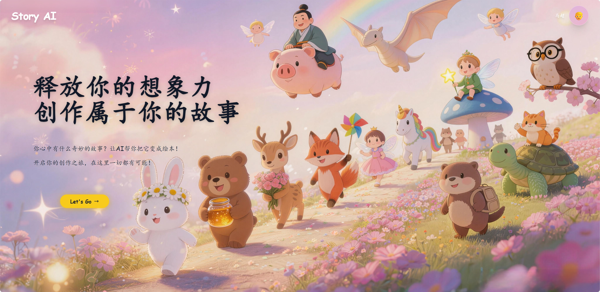

# Story AI — AI 故事共创

面向 3-8 岁儿童的 AI 故事创作 Web 应用。孩子选择角色和场景，AI 自动生成带插画和配音的互动故事。

## 功能

- 🎭 **角色选择** — 8 个风格各异的角色，每个有独特形象和声音
- 🌍 **场景设定** — 天空之城、海洋王国、糖果城堡、数字世界等
- ✍️ **剧情共创** — 孩子输入关键情节，AI 补全故事
- 🎨 **AI 插画** — 每页故事自动生成配图
- 🔊 **语音朗读** — TTS 自动配音，支持家长录入声音
- 📱 **横屏适配** — 手机横屏完整适配，适合儿童手持使用
- 👨‍👩‍👧 **家长中心** — 查看和管理已生成的故事

## 截图




## 技术栈

| 层 | 技术 |
|------|------|
| 前端 | React 18 + TypeScript + Vite + Tailwind CSS |
| 后端 | Node.js + Express + TypeScript |
| 数据库 | MongoDB + SQLite |
| AI 模型 | DeepSeek（文本生成）+ 豆包 ARK（图片生成 + TTS） |
| 图像处理 | Sharp |

## 快速开始

### 环境要求

- Node.js >= 18
- MongoDB（本地运行）

### 安装

```bash
# 安装所有依赖
npm run install:all

# 配置环境变量
cp server/.env.example server/.env
# 编辑 server/.env，填入你的 API 密钥：
#   DEEPSEEK_API_KEY=你的DeepSeek密钥
#   ARK_API_KEY=你的豆包ARK密钥
#   TTS_API_KEY=你的TTS密钥
```

### 运行

```bash
# 同时启动前后端
npm run dev

# 或分别启动
npm run dev:client   # 前端 http://localhost:5173
npm run dev:server   # 后端 http://localhost:3000
```

### 构建

```bash
npm run build
```

## 项目结构

```
story-AI/
├── client/                # 前端 React 应用
│   ├── src/
│   │   ├── pages/         # 页面组件
│   │   │   ├── Home/          # 首页
│   │   │   ├── CharacterSelect/  # 角色选择
│   │   │   ├── AiCreate/      # AI 创作（场景→剧情→等待生成）
│   │   │   ├── StoryPlayer/   # 故事播放器
│   │   │   ├── SavedStories/  # 已保存故事
│   │   │   ├── StoryBox/      # 故事宝盒
│   │   │   └── ParentCenter/  # 家长中心
│   │   ├── shared/        # 共享组件 & 工具
│   │   └── contexts/      # React Context
│   └── public/            # 静态资源（图片、音频、视频）
├── server/                # 后端 Express 服务
│   ├── src/
│   │   ├── routes/        # API 路由
│   │   ├── controllers/   # 请求处理
│   │   ├── services/ai/   # AI 服务（文本、图片、TTS）
│   │   ├── middleware/     # 中间件（认证、限流）
│   │   └── models/        # 数据模型
│   └── .env.example       # 环境变量模板
└── e2e/                   # E2E 测试
```

## 许可

MIT
